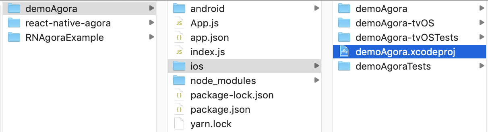
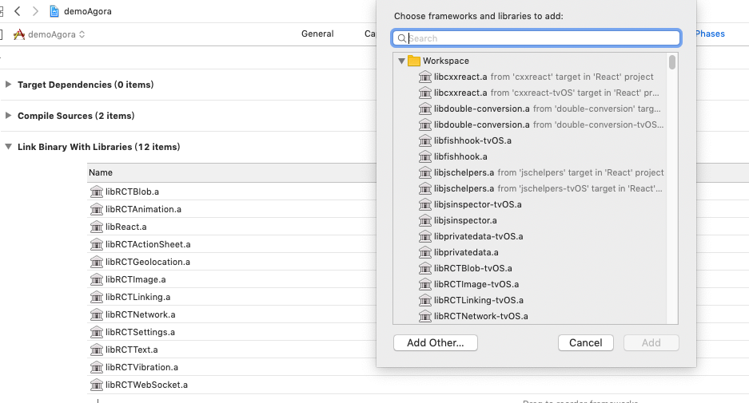
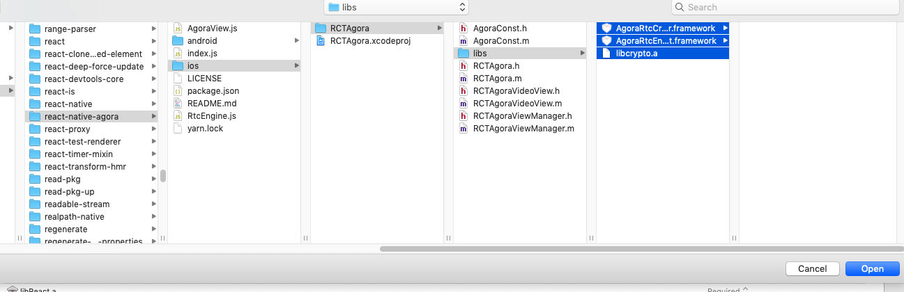
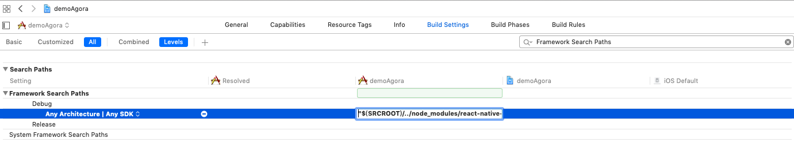
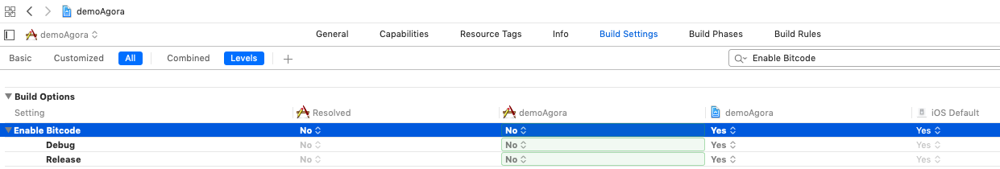
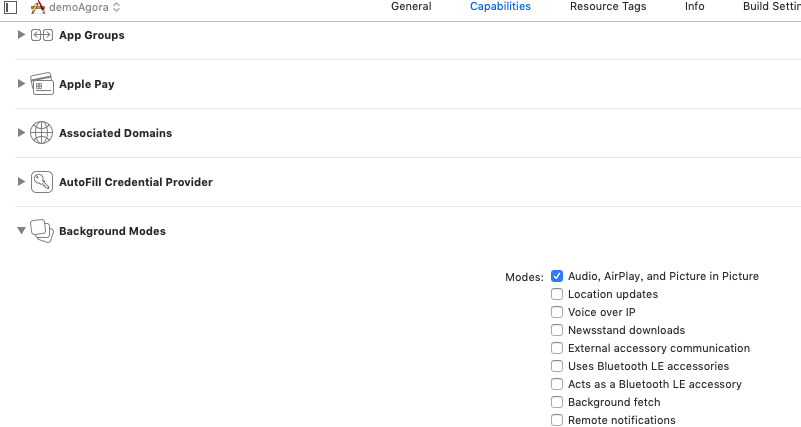
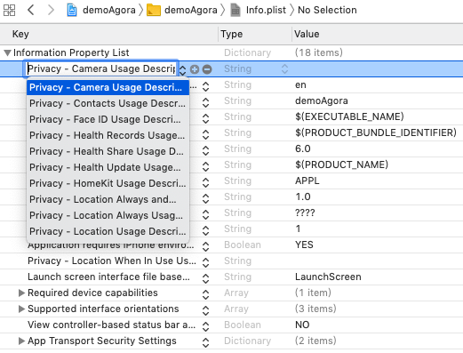
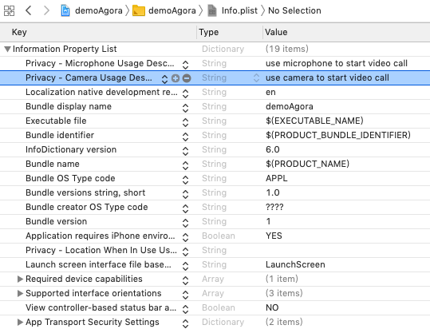

# iOS Installation

# Prerequisites
* You should installed and linked `react-native-agora`
* Xcode 10.0+

# Step 1. Open Project in Xcode
Open `ios/projectName.xcodeproj` with XCode

# Step 2. Add Link Binary With Libraries 
Build Phases -> Link Binary With Libraries -> +

    libresolv.tbd
    libc++.tbd
    AVFoundation.framework
    AudioToolbox.framework
    VideoToolbox.framework
    CoreMotion.framework
    CoreMedia.framework
    CoreTelephony.framework

# Step 3. Add Other Link Binary With Libraries From `node_modules`
Build Phases -> Link Binary With Libraries -> + -> Add Other

    node_modules/react-native-agora/ios/RCTAgora/libs/libcrypto.a
    node_modules/react-native-agora/ios/RCTAgora/libs/AgoraRtcCryptoLoader.framework
    node_modules/react-native-agora/ios/RCTAgora/libs/AgoraRtcEngineKit.framework

# Step 4. Add Framework Search Paths
Build Settings -> Framework Search Paths -> + 

"$(SRCROOT)/../node_modules/react-native-agora/ios/RCTAgora/libs"

# Step 5. Add Library Search Paths
Build Settings -> Library Search Paths -> + 

"$(SRCROOT)/../node_modules/react-native-agora/ios/RCTAgora/libs"

# Step 6. Set Build Settings Enable Bitcode No
Build Settings -> Enable Bitcode -> ...

# Step 7. Set Capabilities Background Modes
Capabilities -> Background Modes -> Audio, Airplay, and Picture in Picture

# Step 8.1 Set info.plist
Change info.plist  
"Privacy - Camera Usage Description":"use camera to start video call"  
"Privacy - Microphone Usage Description":"use microphone to start video call"  

