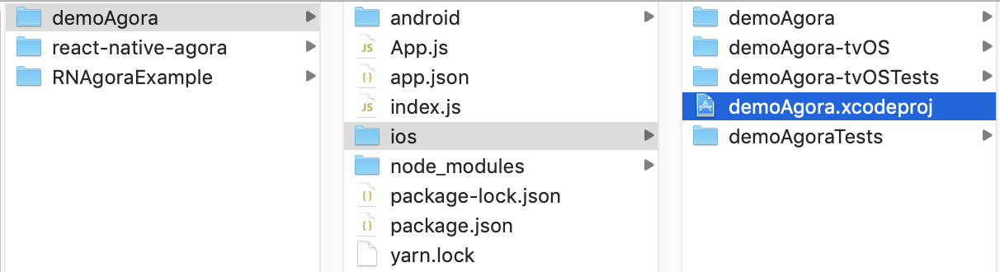
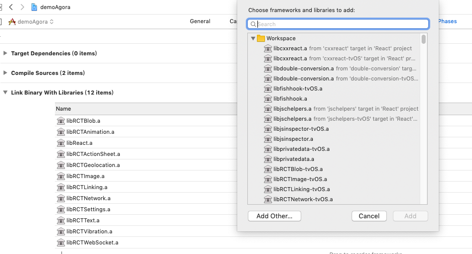
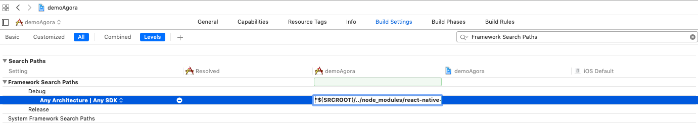
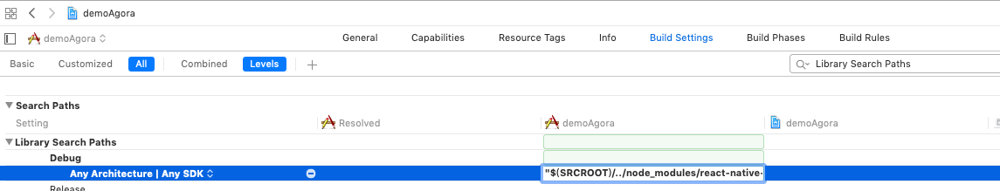
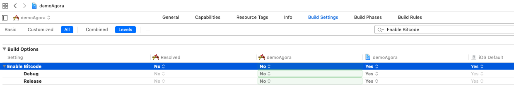
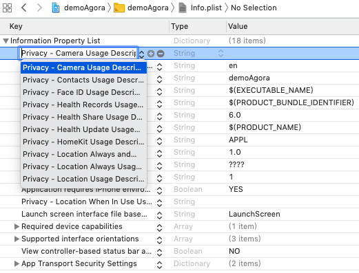
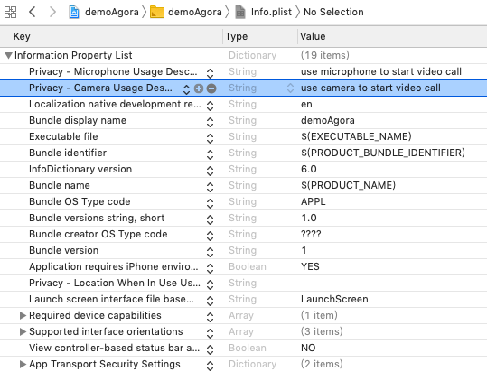

# iOS 开发搭建指南

# 环境
* 请先在项目里安装 `react-native-agora` & `react-native link react-native-agora`
* Xcode 10.0+

# Step 1. 使用Xcode打开ios项目
用Xcode打开RN项目里的`ios/RN项目.xcodeproj`文件

# Step 2. 添加如下的链接库到Xcode工程
选择 Build Phases -> Link Binary With Libraries -> +

    libresolv.tbd
    libc++.tbd
    AVFoundation.framework
    AudioToolbox.framework
    VideoToolbox.framework
    CoreMotion.framework
    CoreMedia.framework
    CoreTelephony.framework
# Step 3. 添加node_modules库到Xcode工程
选择 Build Phases-> Link Binary With Libaries中点击“+”按钮，在弹出的窗口中点击“Add Other”按钮，选择

    node_modules/react-native-agora/ios/RCTAgora/libs/libcrypto.a
    node_modules/react-native-agora/ios/RCTAgora/libs/AgoraRtcCryptoLoader.framework
    node_modules/react-native-agora/ios/RCTAgora/libs/AgoraRtcEngineKit.framework

# Step 4. 添加Framework Search Paths
选择 Build Settings->Search Paths->Framework Search Paths添加
"$(SRCROOT)/../node_modules/react-native-agora/ios/RCTAgora/libs"

# Step 5. 添加Library Search Paths
选择 Build Settings->Search Paths->Library Search Paths添加
"$(SRCROOT)/../node_modules/react-native-agora/ios/RCTAgora/libs"

# Step 6. 设置Build Settings Enable Bitcode No
选择 Build Settings->Enable Bitcode设置为No

# Step 7. 设置Capabilities Background Modes
选择 Capabilities->Background Modes->Modes勾选Audio,AirPlay,and Picture In Picture

# Step 8.1 设置info.plist
修改info.plist
新增2项:  
"Privacy - Camera Usage Description":"use camera to start video call"  
"Privacy - Microphone Usage Description":"use microphone to start video call"

# Step 9 编译
`react-native run-ios`