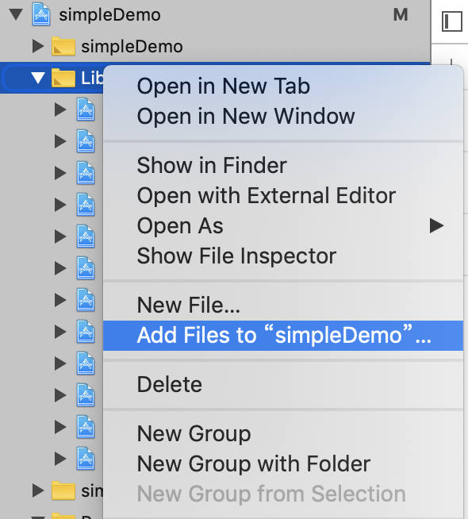
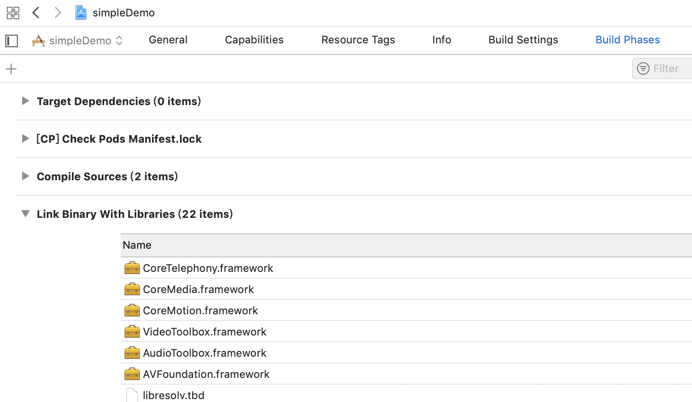

# iOS Installation

# Prerequisites
* You should installed and linked `react-native-agora`
* Xcode 10.0+
* cocoapods

```bash
# installed ruby first then run it
gem install cocoapods
```

# Step 1. install pod dependencies
```bash
pod install
```

# Step 2. Open Workspace Project in Xcode  
Open `ios/projectName.xcworkspace` with XCode


# Step 3. Add RCTAgora to the Project Libraries folder



# Step 4. Add Linked Library to the xcode project



# Step 5. Set Framework and Libraries Search Paths


# Step 6. build and run it with xcode

