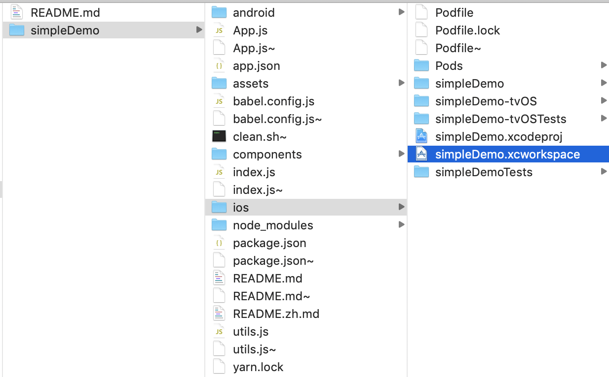

# iOS Installation

# Prerequisites
* You should installed and linked `react-native-agora`
* Xcode 10.0+
* cocoapods

```bash
# Use npm
npm install react-native-agora
```
or

```bash
# Use yarn
yarn add react-native-agora
```
then you need to link the library

```bash
# Link the library
react-native link react-native-agora
```


```bash
# installed ruby first then run it
gem install cocoapods
```

# Step 1. install pod dependencies
```bash
cd ios
pod install
```
pod install success will create `<projectName>`.xcworkspace file in ios folder.

# Step 2. Open the xcworkspace Project in Xcode  
Open `ios/projectName.xcworkspace` with XCode


# Step 3. Add RCTAgora to the Project Libraries folder


select the AgoraRtcEngineKit and re-added by below steps.


# Step 4. Only Add Linked Library to the xcode project


# Step 5. build and run it with xcode
