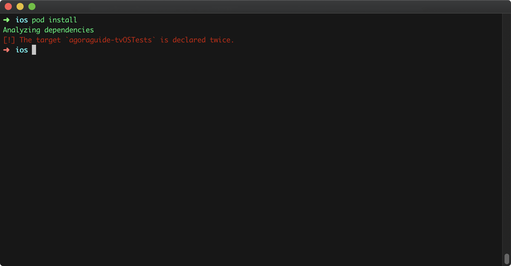
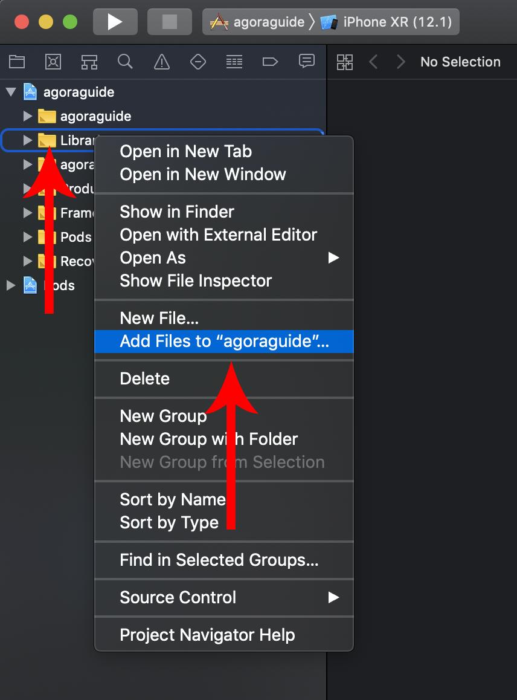
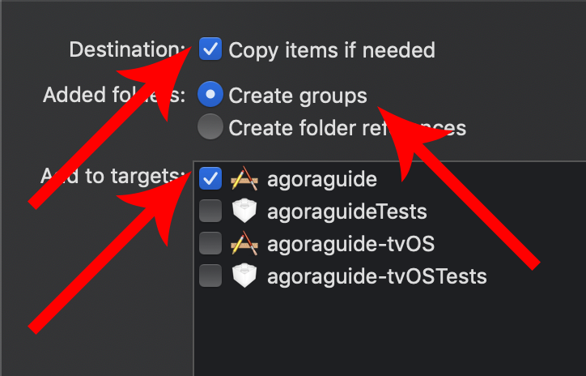
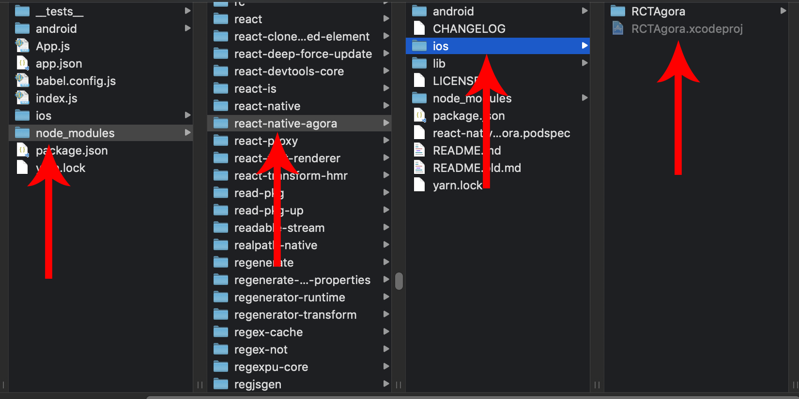
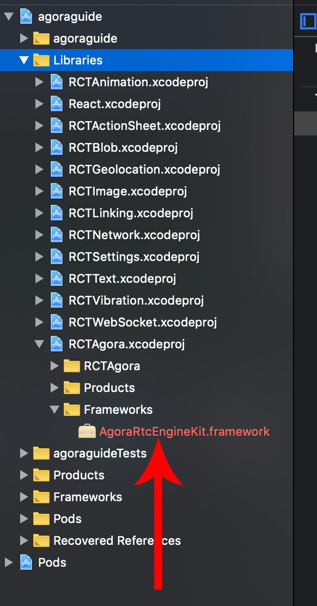
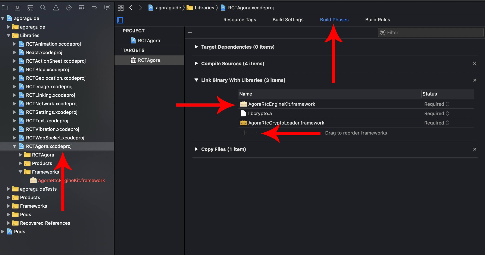
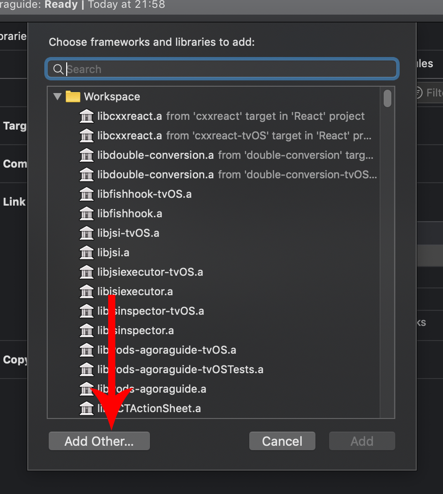
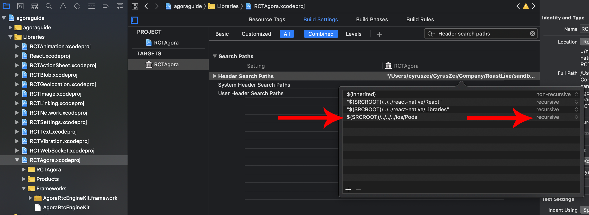

# React native Agora iOS Installation
#### Minimum compatibility
* React native 0.58.x
* iOS SDK 8.0+
* Android 5.0+ x86 arm64 armv7a

#### 1. open up your terminal and write this :
When it comes to the version new release you can put any version you like as long as it is compatibility
```sh
$ react-native init agoraguide --version react-native@0.58
```

#### 2. cd into your project folder
```sh
$ cd agoraguide
```
#### 3. install npm package react-native-agora

with npm


```sh
$ npm install --save react-native-agora
```

or yarn

```sh
$ yarn add react-native-agora
```


#### 4. cd into your ios folder
```sh
$ cd ios
```

#### 5. we need to initialize pod
if you don't have CocoaPods installed run this command in your terminal
```sh
$ gem install cocoapods
```
after you have installed CocoaPods run this command inside of your ios folder
```sh
$ pod init
```
and then we need to install the pods
```sh
$ pod install
```
if you get a error from CocoaPods saying something like this :

then you need to open up your `Podfile` and remove the part that is blue marked in the picture below

#### *before*


#### *after*


we need to add this code at the bottom to our `Podfile`
```sh
post_install do |installer|
  installer.pods_project.targets.each do |target|

    # The following is needed to ensure the "archive" step works in XCode.
    # It removes React & Yoga from the Pods project, as it is already included in the main project.
    # Without this, you'd see errors when you archive like:
    # "Multiple commands produce ... libReact.a"
    # "Multiple commands produce ... libyoga.a"

    targets_to_ignore = %w(React yoga)
    
    if targets_to_ignore.include? target.name
      target.remove_from_project
    end

  end
end
```
This is how your podfile should look like

after that you can run this command again
```sh
$ pod install
```

#### 6. Open up your Xcode project *[project name].xcworkspace* inside in ios folder


#### 7. expand your project folder and right click on the *"Libraries"* folder and choose *"add files to [project name]"*


#### 8. follow the image below to find the RCTAgora lib


the path is  node_modules => react-native-agora => ios => RCTAgora.xcodeproj

make sure you check so that those are checked



If the file is greyed out it means you already have it inside of you library folder.
Check so that RCTAgora.xcodeproj are inside of your "Libraries" folder


#### 9. we need to add the framework
expand your "Frameworks" folder and you should see the "AgoraRtcEngineKit.framework" are red.

right click and delete that
Left click on your "RCTAgora.xcodeproj" and click on "Build Phases"

left click on the "AgoraRtcEngineKit.framework" in the list and click on the "-"(minus sign) to remove it from the list.

then click on the "+"(plus sign) so that we can add the framework.
Click on the "Add other..." button

then we need to navigate and find our framwork

the path is : ios => Pods => AgoraRtcEngine_iOS => AgoraRtcEngineKit.framework and click on "add"

#### 10. at last we need to link the library
click on your project on the left and then click on "Build Phases" and then expand "Link Binary With Libraries" and then click on the "+"(plus sign)

Search for libRCTAgora and click on add

if you cant find it in your list check so that you dont already have it

----------------------------------------------
### Troubleshooting

if you get some errors like the pictures below


the chances are that you have some framework that already have imported time.h something like firestore.

Expand your "Libraries" and then click on "RCTAgora.xcodeproj". Then click on "Build settings" and search for "Header search paths" 

Doubble click on the path

and change the Pods path from "recursive" to non-recursive


