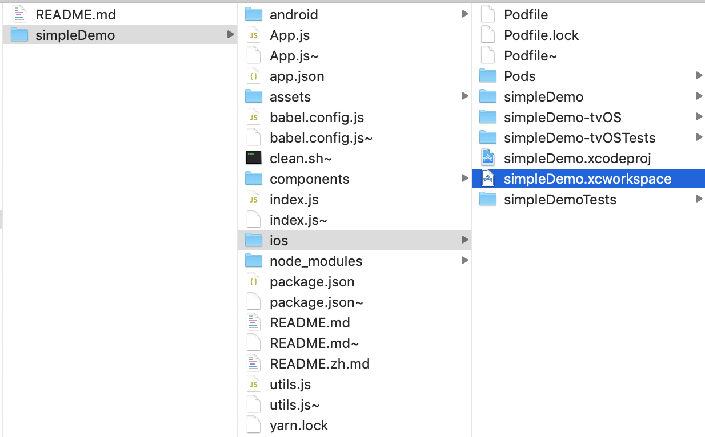
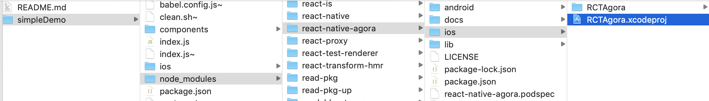
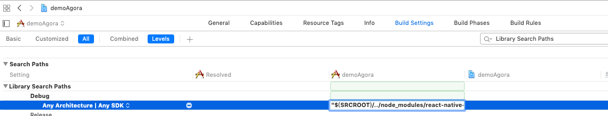

# iOS 开发搭建指南

# 环境
* 请先在项目里安装 `react-native-agora` & `react-native link react-native-agora`
* Xcode 10.0+
* 安装cocoapods

```bash
# 需要首先安装好ruby
gem install cocoapods
```

# Step 1. 首先安装
```bash
pod install
```

# Step 2. 使用xcode开启项目  
打开 `ios/projectName.xcworkspace`


# Step 3. 在项目里新增RCTAgora项目到Libraries目录里



# Step 4. 把react-native-agora添加到linked libraries里


# Step 5. 设置 Framework & Libraries Search Paths




# Step 6. xcode 编译并运行

