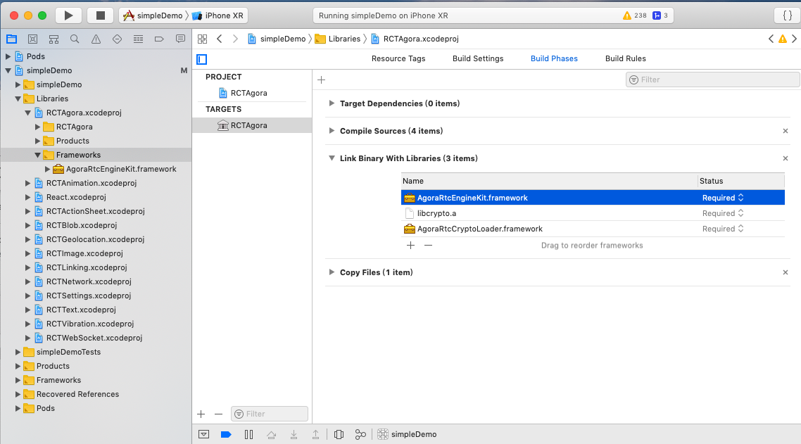
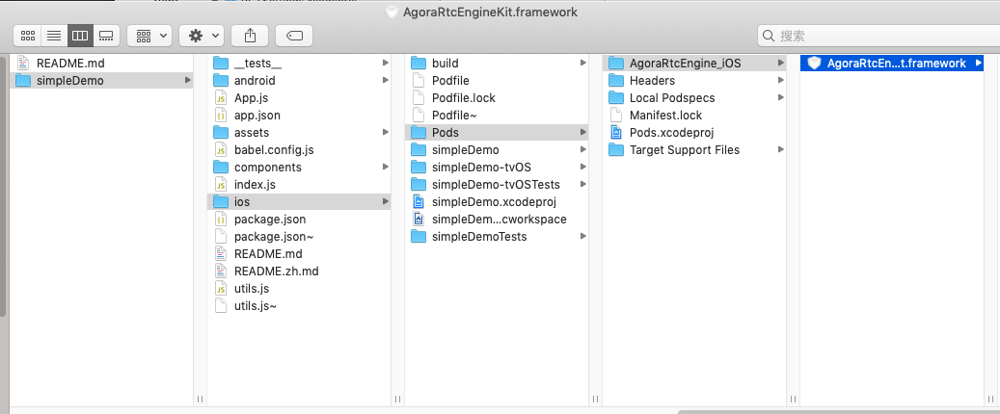

# iOS 开发搭建指南

# 环境
* 请先在项目里安装 `react-native-agora` & `react-native link react-native-agora`
* Xcode 10.0+
* 安装cocoapods

```bash
# 需要首先安装好ruby
gem install cocoapods
```

# Step 1. 首先安装
```bash
pod install
```

# Step 2. 使用xcode开启项目  
打开 `ios/projectName.xcworkspace`


# Step 3. 在项目里新增RCTAgora项目到Libraries目录里


根据以下的步骤。重新加载RCTAgora里面的AgoraRtcEngineKit。




# Step 4. 把RCTAgora.a 添加到linked libraries里


# Step 5. xcode 编译并运行

