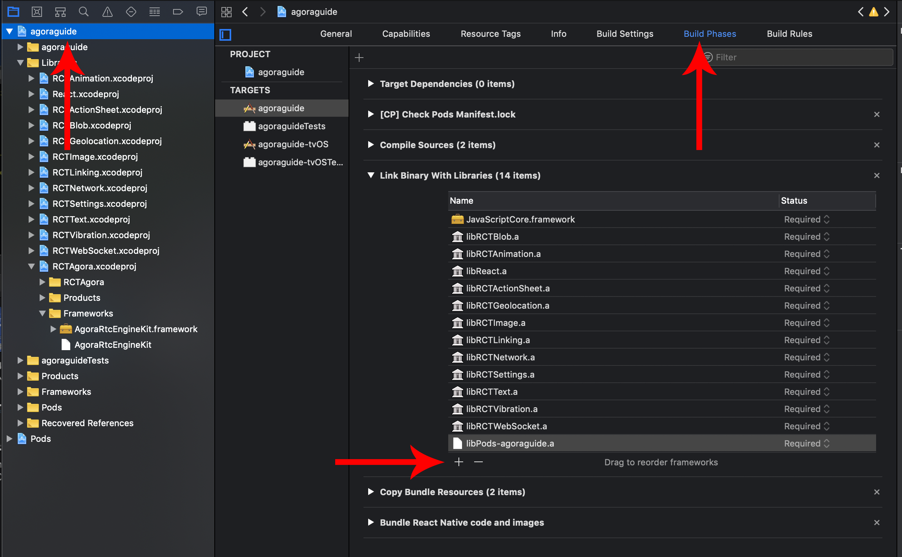
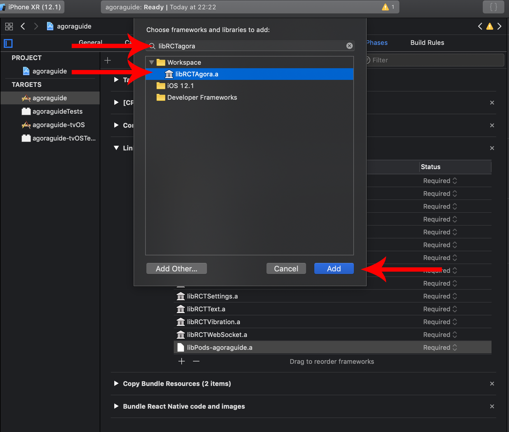
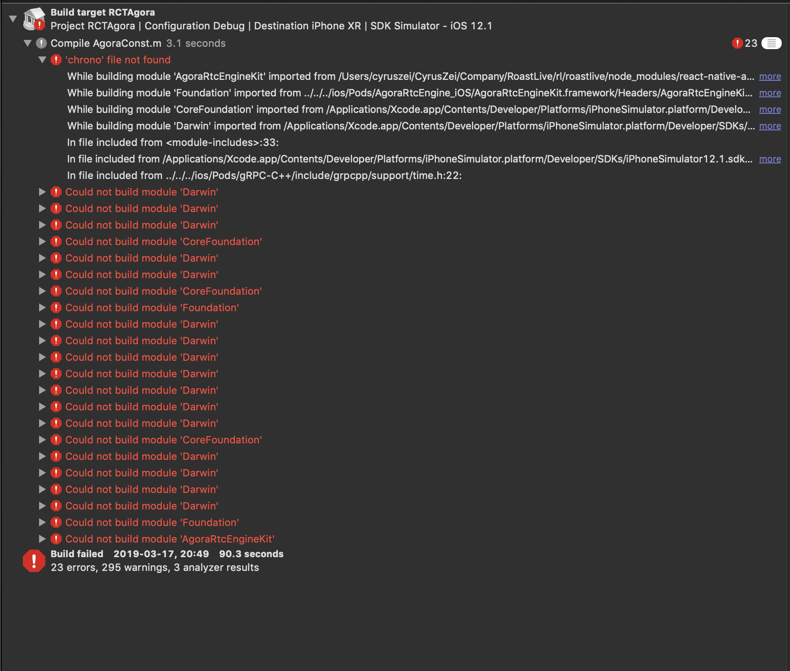
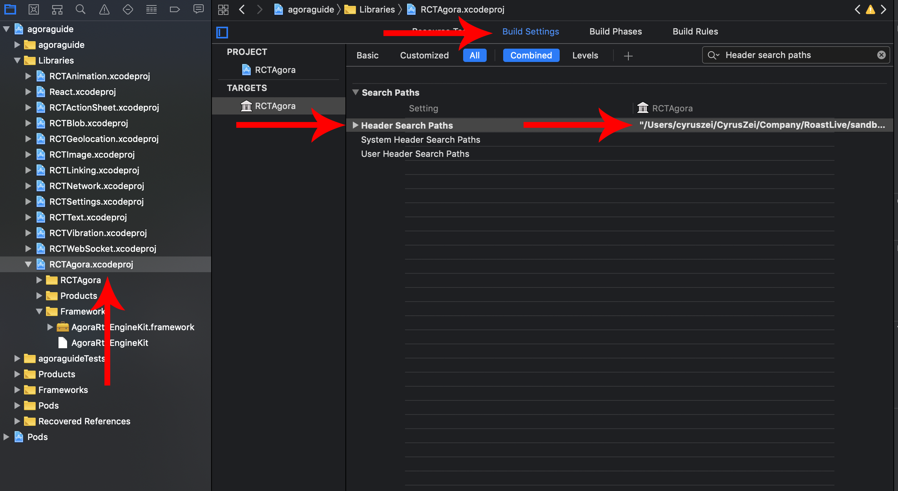
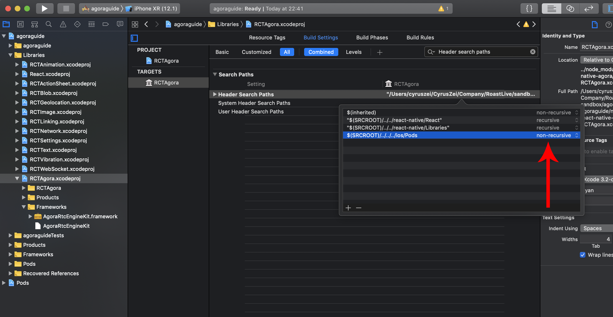

# iOS 开发搭建指南
#### 最低兼容
* React Native 0.58.x
* iOS SDK 8.0+
* Android 5.0+ x86 arm64 armv7a

#### 1. 打开你的终端，输入如下命令：
对于新版本，你可以放置任何你喜欢的版本，只要它兼容。
```
$ react-native init agoraguide --version react-native@0.58
```

#### 2. cd 到你的项目目录
```sh
$ cd agoraguide
```

#### 3. 安装 react-native-agora

npm方式
```sh
$ npm install --save react-native-agora
```

yarn方式
```sh
$ yarn add react-native-agora
```

#### 4. cd 到你的ios目录
```sh
$ cd ios
```

#### 5. 安装pod
如果你没有安装过CocoaPods，在你的终端里输入以下命令并执行：
```sh
$ gem install Cocoapods
```
在成功安装CocoaPods后，在你项目的ios目录里执行以下命令：
```sh
$ pod init
```
接着执行安装pods
```sh
$ pod install
```
当你在安装pod过程中，遇到问题如下的报错时：

你需要打开`Podfile`并且如下图所示的蓝色部分。

#### *选中这部分*


#### *删除后*


在`Podfile`底部加入以下代码：
```sh
post_install do |installer|
  installer.pods_project.targets.each do |target|

    # The following is needed to ensure the "archive" step works in XCode.
    # It removes React & Yoga from the Pods project, as it is already included in the main project.
    # Without this, you'd see errors when you archive like:
    # "Multiple commands produce ... libReact.a"
    # "Multiple commands produce ... libyoga.a"

    targets_to_ignore = %w(React yoga)
    
    if targets_to_ignore.include? target.name
      target.remove_from_project
    end

  end
end
```
这是最终修改好的`Podfile`，如图所示。

之后你就可以执行安装命令：
```
$ pod install
```

#### 6. 在你项目的ios目录里，打开Xcode工程文件 *[项目名].xcworkspace 


#### 7. 展开你的项目目录，并且右键点击*"Libraries"* 目录并且选择*"add file to [project name]"*


#### 8. 按照下图去找到RCTAgora lib

你可以沿路径找到：node_modules => react-native-agora => ios => RCTAgora.xcodeproj

请按照如图所示的方式确认你已经配好编译环境


如果下图所示的文件是灰色的，请确保它的路径是在你的目录里的。
请检查`RCTAgora.xcodeproj`是否在`Libraries`目录中。


#### 9. 检查你的Framework是否已经成功设置
展开你的 "Frameworks" 目录，如果看到红色的 "AgoraRtcEngineKit.framework"，你需要按照以下步骤重新把它载入到编译环境。

单击右键并删除。
单击左键 "RCTAgora.xcodeproj" 找到并点击 "Build Phases"

在列表里找到 "AgoraRtcEngineKit.framework" 单击左键 找到 "-"(减号按钮) 把它从列表里删除。

然后点击"+"(加号按钮) 点击"Add other..."按钮。

按照图下方式，找到"AgoraRtcEngineKit.framework"

你可以沿路径找到: ios => Pods => AgoraRtcEngine_iOS => AgoraRtcEngineKit.framework 并且点击 "add"

#### 10. 最后我们需要连接Library
点击你的项目左侧，并且点击"Build Phases"然后展开"Link Binary With Libraries"接着点击"+"(加号按钮）
click on your project on the left and then click on "Build Phases" and then expand "Link Binary With Libraries" and then click on the "+"(plug sign)

找到 libRCTAgora 并且点击"add"

如果你无法在列表里找到它，表明你还没安装它。

----------------------------------------------
### 常见故障排除

如果你遇到类似的报错：



可能是因为你有一些框架已经导入了相同的头文件，例如firestore库也会引入time.h, 

展开你项目里的"Libraries" 并且点击"RCTAgora.xcodeproj"。然后点击"Build settings" 并且找到"Header search paths"，按照以下方法设置。 

双击当前选中的路径

把路径里的"recursive"修改成"non-recursive"



