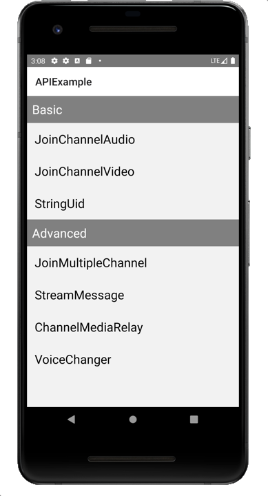

# API-Example-ReactNative

*__其他语言版本：__  [__简体中文__](README.zh.md)*

## Overview

The API-Example-ReactNative project is an open-source demo that will show you different scenes on how to integrate Agora SDK APIs into your project.

Any scene of this project can run successfully alone.

## Project structure

* **Basic demos:**

| Demo                                                         | Description                                        | APIs                                                        |
| ------------------------------------------------------------ | -------------------------------------------------- | ----------------------------------------------------------- |
| [JoinChannelAudio](./src/examples/basic/JoinChannelAudio) | Audio live streaming | |
| [JoinChannelVideo](./src/examples/basic/JoinChannelVideo) | Video live streaming | |
| [StringUid](./src/examples/basic/StringUid) | String user ID | |

* **Advanced demos:**

| Demo                                                         | Description                                                  | APIs                                                         |
| ------------------------------------------------------------ | ------------------------------------------------------------ | ------------------------------------------------------------ |
| [JoinMultipleChannel](./src/examples/advanced/JoinMultipleChannel) | Join multiple channels | |
| [VoiceChanger](./src/examples/advanced/VoiceChanger) | Voice effects | |
| [ChannelMediaRelay](./src/examples/advanced/ChannelMediaRelay) | Channel media relay | |
| [StreamMessage](./src/examples/advanced/StreamMessage) | Send data stream  | |

## How to run the sample project

#### Developer Environment Requirements

- [React Native](https://reactnative.dev/docs/environment-setup)

#### Steps to run

*Steps from cloning the code to running the project*

1. Open the [CONTRIBUTING.md](../CONTRIBUTING.md).
2. Read the [Development workflow](../CONTRIBUTING.md#development-workflow).
3. Open [agora.config.json](./src/config/agora.config.json) file and specify your App ID and Token.

   > See [Set up Authentication](https://docs.agora.io/en/Agora%20Platform/token) to learn how to get an App ID and access token. You can get a temporary access token to quickly try out this sample project.
   >
   > The Channel name you used to generate the token must be the same as the channel name you use to join a channel.

   > To ensure communication security, Agora uses access tokens (dynamic keys) to authenticate users joining a channel.
   >
   > Temporary access tokens are for demonstration and testing purposes only and remain valid for 24 hours. In a production environment, you need to deploy your own server for generating access tokens. See [Generate a Token](https://docs.agora.io/en/Interactive%20Broadcast/token_server) for details.

4. Make the project and run the app in the simulator or connected physical device.

You are all set! Feel free to play with this sample project and explore features of the Agora RTC SDK.

## Feedback

If you have any problems or suggestions regarding the sample projects, feel free to file an issue.

## Reference

- [Product Overview](https://docs.agora.io/en/Interactive%20Broadcast/product_live?platform=React%20Native)
- [API Reference](https://docs.agora.io/en/Interactive%20Broadcast/API%20Reference/react_native/index.html)

## Related resources

- Check our [FAQ](https://docs.agora.io/en/faq) to see if your issue has been recorded.
- Dive into [Agora SDK Samples](https://github.com/AgoraIO) to see more tutorials
- Take a look at [Agora Use Case](https://github.com/AgoraIO-usecase) for more complicated real use case
- Repositories managed by developer communities can be found at [Agora Community](https://github.com/AgoraIO-Community)
- If you encounter problems during integration, feel free to ask questions in [Stack Overflow](https://stackoverflow.com/questions/tagged/agora.io)

## License

The sample projects are under the MIT license.
