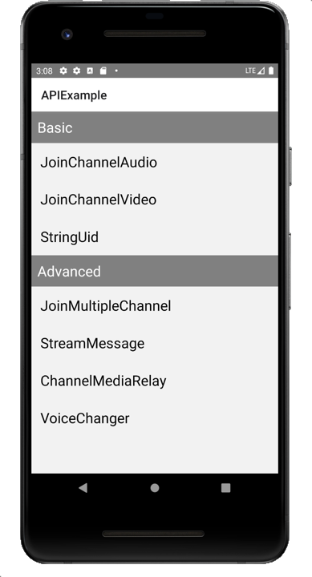

# API-Example-ReactNative

*Read this in other languages: [English](README.md)*

## 简介

这个开源示例项目演示了不同场景下，Agora SDK 的基本集成逻辑。 项目中每个 Scene 都是一个独立的场景，都可以成功独立运行。

在这个示例项目中包含的所有场景都可以独立运行：

## 项目结构

* **基础案例:**

| Demo                                                         | Description                                        | APIs                                                         |
| ------------------------------------------------------------ | -------------------------------------------------- | ------------------------------------------------------------ |
| [JoinChannelAudio](./src/examples/basic/JoinChannelAudio) | 音频直播 | GetEngine, JoinChannelByKey, LeaveChannel |
| [JoinChannelVideo](./src/examples/basic/JoinChannelVideo) | 视频直播 | SetChannelProfile,SetClientRole,EnableVideo,EnableVideoObserver, JoinChannelByKey, VideoSurface |
| [StringUid](./src/examples/basic/StringUid) | 字符串用户ID | SetChannelProfile,SetClientRole,EnableVideo,EnableVideoObserver, JoinChannelByKey, VideoSurface |

* **进阶案例:**

| Demo                                                         | Description                                                  | APIs                                                         |
| ------------------------------------------------------------ | ------------------------------------------------------------ | ------------------------------------------------------------ |
| [JoinMultipleChannel](./src/examples/advanced/JoinMultipleChannel) | 加入多频道 | CreateChannel, SetClientRole, EnableEncryption, LeaveChannel, ReleaseChannel |
| [VoiceChanger](./src/examples/advanced/VoiceChanger) | 音频效果 | SetOnCaptureVideoFrameCallback, SetOnRenderVideoFrameCallback, OnRenderVideoFrameHandler, OnCaptureVideoFrameHandler |
| [ChannelMediaRelay](./src/examples/advanced/ChannelMediaRelay) | 频道媒体流转发 | RegisterAudioRawDataObserver, SetOnPlaybackAudioFrameCallback, OnPlaybackAudioFrameHandler |
| [StreamMessage](./src/examples/advanced/StreamMessage) | 发送数据流 | SetVideoEncoderConfiguration, SetLiveTranscoding, AddPublishStreamUrl, RemovePublishStreamUrl |

## 如何运行示例程序

#### 运行环境

- [React Native](https://reactnative.dev/docs/environment-setup)

#### 运行步骤

*从拉取仓库到成功运行的全部步骤*

1. 打开 [CONTRIBUTING.md](../CONTRIBUTING.md) 文件。
2. 阅读 [Development workflow](../CONTRIBUTING.md#development-workflow)。
3. 在 [agora.config.json](./src/config/agora.config.json) 文件中设置你的 App ID 和 Token。

   > 参考 [校验用户权限](https://docs.agora.io/cn/Agora%20Platform/token) 了解如何获取 App ID 和 Token。你可以获取一个临时 token，快速运行示例项目。
   >
   > 生成 Token 使用的频道名必须和加入频道时使用的频道名一致。

   > 为提高项目的安全性，Agora 使用 Token（动态密钥）对即将加入频道的用户进行鉴权。
   >
   > 临时 Token 仅作为演示和测试用途。在生产环境中，你需要自行部署服务器签发 Token，详见[生成 Token](https://docs.agora.io/cn/Interactive%20Broadcast/token_server)。

4. 构建项目，在虚拟器或真实 Android 设备中运行项目。

一切就绪。你可以自由探索示例项目，体验 SDK 的丰富功能。

## 反馈

如果你有任何问题或建议，可以通过 issue 的形式反馈。

## 参考文档

- [RTC React Native SDK 产品概述](https://docs.agora.io/cn/Interactive%20Broadcast/product_live?platform=React%20Native)
- [RTC React Native SDK API 参考](https://docs.agora.io/cn/Interactive%20Broadcast/API%20Reference/react_native/index.html)

## 相关资源

- 你可以先参阅[常见问题](https://docs.agora.io/cn/faq)
- 如果你想了解更多官方示例，可以参考[官方 SDK 示例](https://github.com/AgoraIO)
- 如果你想了解声网 SDK 在复杂场景下的应用，可以参考[官方场景案例](https://github.com/AgoraIO-usecase)
- 如果你想了解声网的一些社区开发者维护的项目，可以查看[社区](https://github.com/AgoraIO-Community)
- 若遇到问题需要开发者帮助，你可以到[开发者社区](https://rtcdeveloper.com/)提问
- 如果需要售后技术支持, 你可以在[Agora Dashboard](https://dashboard.agora.io/)提交工单

## 代码许可

示例项目遵守 MIT 许可证。
